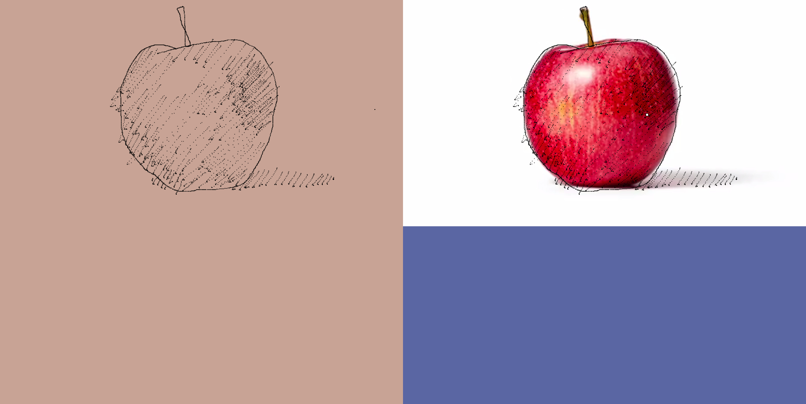

# proto-mirrordraw

[Click Here](https://codedmitry.github.io/proto-mirrordraw) to visit the webapp.

A quick and dirty prototype for a "mirror" drawing web application for learning to trace images to develop/test your muscle memory.

Instructions:
- Q to clear
- E to load image

Image loading expects the image address, one way to get an image address is by right clicking google image results or long pressing images on touch devices and copying the image address.

If you are using a touch device, click the button in the marquee to load the image.

The prototype is intentionally limited in features and tries maximizing backward compatibility.
